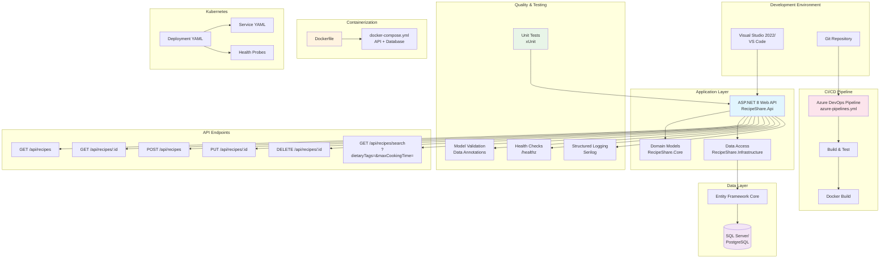

# RecipeShare Architecture Documentation

## 🏗️ System Architecture Overview

RecipeShare is a containerized .NET Web API application designed for flexible deployment across different environments, from local development to production Kubernetes clusters.

## 🔧 Technology Stack

### Core Technologies
- **.NET 8.0**: Latest LTS version with improved performance and features
- **ASP.NET Core Web API**: RESTful API framework with built-in dependency injection
- **Entity Framework Core**: Modern ORM with code-first approach
- **SQL Server 2022 Express**: Reliable relational database with container support

### Infrastructure
- **Docker**: Containerization for consistent environments
- **Docker Compose**: Local development and testing orchestration
- **Kubernetes**: Production-grade container orchestration
- **GitHub Actions**: CI/CD pipeline with automated testing and deployment

### Development Tools
- **Swagger/OpenAPI**: Automated API documentation and testing interface
- **SonarCloud**: Code quality analysis and security scanning

---
# 🏛️ Application Architecture


Below is a high-level overview of the architecture on the RecipeShare project, showcasing the key components and their interactions.



### Layered Architecture Pattern

```
┌─────────────────────────────────────┐
│           Presentation Layer        │
│         (RecipeShare.Api)           │
│   • Controllers                     │
│   • DTOs                           │
│   • API Middleware                 │
│   • Swagger Documentation          │
└─────────────────────────────────────┘
                    │
┌─────────────────────────────────────┐
│            Business Layer           │
│         (RecipeShare.Core)          │
│   • Domain Models                   │
│   • Business Logic                  │
│   • Service Interfaces             │
│   • Domain Events                  │
└─────────────────────────────────────┘
                    │
┌─────────────────────────────────────┐
│         Data Access Layer           │
│    (RecipeShare.Infrastructure)     │
│   • Entity Framework Context       │
│   • Repository Implementations     │
│   • Database Migrations            │
│   • External Service Integrations  │
└─────────────────────────────────────┘
                    │
┌─────────────────────────────────────┐
│            Database Layer           │
│          (SQL Server 2022)          │
│   • Recipe Data                     │
│   • User Management                 │
│   • Relational Data Model          │
└─────────────────────────────────────┘
```

### Key Design Principles

1. **Separation of Concerns**: Clear boundaries between presentation, business, and data layers
2. **Dependency Inversion**: High-level modules don't depend on low-level modules
3. **Single Responsibility**: Each class has one reason to change
4. **Open/Closed Principle**: Open for extension, closed for modification

## 🚀 Deployment Architectures

### 1. Docker Compose Architecture (Development/Testing)

```
┌─────────────────────────────────────────────────────────────┐
│                    Docker Host                               │
│                                                             │
│  ┌─────────────────┐    ┌───────────────────────────────┐   │
│  │  recipeshare-api │    │      recipeshare-db          │   │
│  │                 │    │                               │   │
│  │  • .NET 8 API   │◄──►│  • SQL Server 2022           │   │
│  │  • Port 8080    │    │  • Port 1433                  │   │
│  │  • Health Check │    │  • Persistent Volume          │   │
│  └─────────────────┘    │  • Health Check               │   │
│           │              └───────────────────────────────┘   │
│           │                                                  │
│  ┌─────────────────┐                                         │
│  │   Bridge Network │                                        │
│  │  recipeshare-net │                                        │
│  └─────────────────┘                                         │
└─────────────────────────────────────────────────────────────┘
         │
    ┌─────────┐
    │  Host   │
    │Port 8080│
    └─────────┘
```

**Characteristics:**
- Single host deployment
- Automatic service discovery via container names
- Shared bridge network for inter-service communication
- Volume mounting for database persistence
- Health checks for service monitoring

### 2. Kubernetes Architecture (Production)

```
┌─────────────────────────────────────────────────────────────────────────────────┐
│                              Kubernetes Cluster                                 │
│                                                                                 │
│  ┌─────────────────────────────────────────────────────────────────────────┐   │
│  │                            Namespace: default                           │   │
│  │                                                                         │   │
│  │  ┌────────────────┐  ┌─────────────────┐  ┌──────────────────────────┐  │   │
│  │  │   ConfigMap    │  │     Secret      │  │    PersistentVolume      │  │   │
│  │  │recipeshare-cfg │  │recipeshare-sec  │  │    sqlserver-pvc         │  │   │
│  │  │• ENV configs   │  │• DB credentials │  │  • Database storage      │  │   │
│  │  └────────────────┘  └─────────────────┘  └──────────────────────────┘  │   │
│  │                                                                         │   │
│  │  ┌─────────────────────────────────────────────────────────────────┐   │   │
│  │  │                    API Tier                                     │   │   │
│  │  │  ┌───────────────┐  ┌───────────────┐                          │   │   │
│  │  │  │  API Pod 1    │  │  API Pod 2    │                          │   │   │
│  │  │  │• .NET 8 API   │  │• .NET 8 API   │                          │   │   │
│  │  │  │• Port 8080    │  │• Port 8080    │                          │   │   │
│  │  │  │• Liveness     │  │• Liveness     │                          │   │   │
│  │  │  │• Readiness    │  │• Readiness    │                          │   │   │
│  │  │  └───────────────┘  └───────────────┘                          │   │   │
│  │  │                           │                                     │   │   │
│  │  │              ┌─────────────────────────┐                        │   │   │
│  │  │              │   API Service           │                        │   │   │
│  │  │              │ • LoadBalancer          │                        │   │   │
│  │  │              │ • NodePort 30080        │                        │   │   │
│  │  │              │ • Health Check Routing  │                        │   │   │
│  │  │              └─────────────────────────┘                        │   │   │
│  │  └─────────────────────────────────────────────────────────────────┘   │   │
│  │                                                                         │   │
│  │  ┌─────────────────────────────────────────────────────────────────┐   │   │
│  │  │                  Database Tier                                  │   │   │
│  │  │  ┌─────────────────────────────────────────────────────────┐   │   │   │
│  │  │  │              SQL Server Pod                             │   │   │   │
│  │  │  │ • SQL Server 2022 Express                              │   │   │   │
│  │  │  │ • Port 1433                                             │   │   │   │
│  │  │  │ • Persistent Volume Mount                               │   │   │   │
│  │  │  │ • Resource Limits (2Gi Memory, 1 CPU)                  │   │   │   │
│  │  │  │ • TCP Health Checks                                     │   │   │   │
│  │  │  └─────────────────────────────────────────────────────────┘   │   │   │
│  │  │                           │                                     │   │   │
│  │  │              ┌─────────────────────────┐                        │   │   │
│  │  │              │   Database Service      │                        │   │   │
│  │  │              │ • ClusterIP             │                        │   │   │
│  │  │              │ • Internal Port 1433    │                        │   │   │
│  │  │              │ • Service Discovery     │                        │   │   │
│  │  │              └─────────────────────────┘                        │   │   │
│  │  └─────────────────────────────────────────────────────────────────┘   │   │
│  └─────────────────────────────────────────────────────────────────────────┘   │
└─────────────────────────────────────────────────────────────────────────────────┘
                                      │
                           ┌─────────────────┐
                           │   External      │
                           │ Access Points   │
                           │• NodePort 30080 │
                           │• Ingress (opt)  │
                           └─────────────────┘
```

**Characteristics:**
- Multi-pod deployment with horizontal scaling
- Service discovery through Kubernetes DNS
- ConfigMaps and Secrets for configuration management
- Persistent volumes for stateful data
- Health checks and automatic restart policies
- Load balancing across API replicas

## 🔄 Data Flow Architecture

### Request Processing Flow

```
┌─────────┐    ┌─────────────┐    ┌──────────────┐    ┌─────────────┐    ┌──────────┐
│ Client  │───►│   Service   │───►│  Controller  │───►│   Service   │───►│Database  │
│(Browser)│    │(K8s/Docker) │    │ (API Layer)  │    │(Business)   │    │(SQL Srv)│
└─────────┘    └─────────────┘    └──────────────┘    └─────────────┘    └──────────┘
     │                 │                   │                  │               │
     │                 │                   │                  │               │
     ▼                 ▼                   ▼                  ▼               ▼
1. HTTP Request   2. Load Balance   3. Route Request   4. Execute Logic  5. Query Data
   - GET/POST        - Health Check     - Validate Input   - Apply Rules     - EF Core
   - JSON Payload    - Route Traffic    - Deserialize      - Transform       - LINQ
   - Headers         - SSL Termination  - Authentication   - Validate        - Transactions
```

### Database Schema Architecture

```sql
┌─────────────────────────────────────────────────────────────────┐
│                        Recipe Database                          │
├─────────────────────────────────────────────────────────────────┤
│                                                                 │
│  ┌─────────────┐     ┌─────────────────┐     ┌──────────────┐   │
│  │   Users     │────►│    Recipes      │◄────│  Categories  │   │
│  │             │     │                 │     │              │   │
│  │• UserId     │     │• RecipeId       │     │• CategoryId  │   │
│  │• Username   │     │• Title          │     │• Name        │   │
│  │• Email      │     │• Description    │     │• Description │   │
│  │• Created    │     │• Instructions   │     │              │   │
│  └─────────────┘     │• CreatedBy      │     └──────────────┘   │
│                      │• CategoryId     │                        │
│                      │• DietaryTags    │                        │
│                      │• PrepTime       │                        │
│                      │• CookTime       │                        │
│                      │• Servings       │                        │
│                      └─────────────────┘                        │
│                                                                 │
│  ┌─────────────────┐     ┌─────────────────┐                   │
│  │  Ingredients    │◄────│RecipeIngredients│                   │
│  │                 │     │                 │                   │
│  │• IngredientId   │     │• RecipeId       │                   │
│  │• Name           │     │• IngredientId   │                   │
│  │• Description    │     │• Quantity       │                   │
│  │• Unit           │     │• Unit           │                   │
│  └─────────────────┘     │• Notes          │                   │
│                          └─────────────────┘                   │
└─────────────────────────────────────────────────────────────────┘
```

## 🔐 Security Architecture

### Container Security
- **Non-root user**: Applications run as non-privileged users
- **Minimal base images**: Using official Microsoft runtime images
- **Read-only root filesystem**: Where possible to prevent tampering
- **Resource limits**: CPU and memory constraints to prevent resource exhaustion

### Network Security
- **Service isolation**: Database not exposed to external network
- **TLS encryption**: HTTPS enabled for external communication
- **Network policies**: Kubernetes network segmentation (optional)
- **Service mesh ready**: Compatible with Istio/Linkerd for advanced security

### Data Security
- **Connection encryption**: TLS for database connections
- **Secret management**: Kubernetes secrets for sensitive data
- **Environment isolation**: Separate configurations per environment
- **Database security**: SQL Server authentication and authorization

## 📊 Monitoring and Observability

### Health Checks
```
Application Health Pyramid:

┌─────────────────────────────────────┐
│           Deep Health               │  ← Database connectivity
│      (Component Health)             │    External service status
├─────────────────────────────────────┤
│          Liveness Probe             │  ← Process is running
│      (Container Health)             │    HTTP endpoint responds
├─────────────────────────────────────┤
│         Readiness Probe             │  ← Ready to serve traffic
│       (Service Health)              │    Dependencies available
└─────────────────────────────────────┘
```

### Logging Strategy
- **Structured logging**: JSON format for easy parsing
- **Correlation IDs**: Request tracing across services
- **Log levels**: Configurable verbosity per environment
- **Centralized collection**: Ready for ELK stack or similar

### Metrics Collection
- **Application metrics**: Request count, response time, error rate
- **Infrastructure metrics**: CPU, memory, disk usage
- **Business metrics**: Recipe creation rate, user engagement
- **Container metrics**: Docker/Kubernetes native monitoring

## 🔄 CI/CD Architecture

### Pipeline Stages

```
┌─────────────┐    ┌─────────────┐    ┌─────────────┐    ┌─────────────┐
│   Source    │───►│    Build    │───►│    Test     │───►│   Security  │
│             │    │             │    │             │    │             │
│• Git Push   │    │• .NET Build │    │• Unit Tests │    │• SAST Scan  │
│• PR Create  │    │• Docker     │    │• Integration│    │• Container  │
│• Branch     │    │• Restore    │    │• Coverage   │    │• Dependency │
└─────────────┘    └─────────────┘    └─────────────┘    └─────────────┘
                                                                   │
┌─────────────┐    ┌─────────────┐    ┌─────────────┐             │
│   Deploy    │◄───│   Release   │◄───│   Package   │◄────────────┘
│             │    │             │    │             │
│• K8s Apply  │    │• Tag Image  │    │• Push Image │
│• Rollout    │    │• GitHub     │    │• Artifacts  │
│• Verify     │    │• Notify     │    │• Manifest   │
└─────────────┘    └─────────────┘    └─────────────┘
```

### Environment Promotion

```
Development → Staging → Production

┌─────────────┐    ┌─────────────┐    ┌─────────────┐
│Development  │    │   Staging   │    │ Production  │
│             │    │             │    │             │
│• Auto Deploy│───►│• Auto Deploy│───►│Manual Deploy│
│• Feature    │    │• Integration│    │• Release    │
│• Docker     │    │• K8s Local  │    │• K8s Prod   │
│• Compose    │    │• Full Stack │    │• HA Setup   │
└─────────────┘    └─────────────┘    └─────────────┘
```

## 🚀 Scalability Considerations

### Horizontal Scaling
- **Stateless API**: No server-side session state
- **Database connection pooling**: Efficient resource utilization
- **Kubernetes HPA**: Automatic pod scaling based on CPU/memory
- **Load balancing**: Even distribution of requests

### Vertical Scaling
- **Resource limits**: Configurable CPU and memory per container
- **Performance profiling**: Identify bottlenecks
- **Database optimization**: Indexing and query optimization

### Future Enhancements
- **Microservices split**: User service, Recipe service, etc.
- **Event-driven architecture**: Message queues for async processing
- **Caching layer**: Redis for frequently accessed data
- **CDN integration**: Static asset distribution

## 📋 Deployment Patterns

### Blue-Green Deployment
- Maintain two identical environments
- Switch traffic between environments
- Zero-downtime deployments
- Easy rollback capability

### Rolling Updates
- Kubernetes default deployment strategy
- Gradual replacement of old pods
- Configurable update parameters
- Automatic rollback on failure

### Canary Deployment
- Deploy to subset of users first
- Monitor metrics and feedback
- Gradual traffic increase
- Risk mitigation strategy

---
## Conclusion
This architecture provides a solid foundation for a modern, scalable, and maintainable recipe sharing platform while supporting multiple deployment scenarios from local development to production Kubernetes clusters.