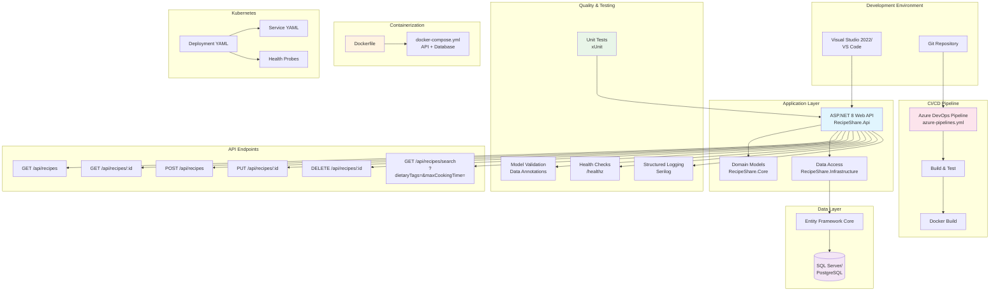

# Service Architecture
## Recipe-Share

Below is a high-level overview of the architecture on the RecipeShare project, showcasing the key components and their interactions.

```mermaid
graph TB
    subgraph "Development Environment"
        VS[Visual Studio 2022/<br/>VS Code]
        GIT[Git Repository]
    end
    
    subgraph "Application Layer"
        API[ASP.NET 8 Web API<br/>RecipeShare.Api]
        CORE[Domain Models<br/>RecipeShare.Core]
        INFRA[Data Access<br/>RecipeShare.Infrastructure]
    end
    
    subgraph "Data Layer"
        EF[Entity Framework Core]
        DB[(SQL Server/<br/>PostgreSQL)]
    end
    
    subgraph "Quality & Testing"
        VALID[Model Validation<br/>Data Annotations]
        TESTS[Unit Tests<br/>xUnit]
        HEALTH[Health Checks<br/>/healthz]
        LOGS[Structured Logging<br/>Serilog]
    end
    
    subgraph "Containerization"
        DOCKER[Dockerfile]
        COMPOSE[docker-compose.yml<br/>API + Database]
    end
    
    subgraph "Kubernetes"
        DEPLOY[Deployment YAML]
        SVC[Service YAML]
        PROBES[Health Probes]
    end
    
    subgraph "CI/CD Pipeline"
        PIPELINE[Azure DevOps Pipeline<br/>azure-pipelines.yml]
        BUILD[Build & Test]
        IMAGE[Docker Build]
    end
    
    subgraph "API Endpoints"
        GET1[GET /api/recipes]
        GET2[GET /api/recipes/:id]
        POST[POST /api/recipes]
        PUT[PUT /api/recipes/:id]
        DELETE[DELETE /api/recipes/:id]
        SEARCH[GET /api/recipes/search<br/>?dietaryTags=&maxCookingTime=]
    end
    
    %% Development connections
    VS --> API
    GIT --> PIPELINE
    
    %% Application layer connections
    API --> CORE
    API --> INFRA
    INFRA --> EF
    EF --> DB
    
    %% API endpoint connections
    API --> GET1
    API --> GET2
    API --> POST
    API --> PUT
    API --> DELETE
    API --> SEARCH
    
    %% Quality connections
    API --> VALID
    API --> HEALTH
    API --> LOGS
    TESTS --> API
    
    %% Container connections
    DOCKER --> COMPOSE
    
    %% Kubernetes connections
    DEPLOY --> SVC
    DEPLOY --> PROBES
    
    %% CI/CD connections
    PIPELINE --> BUILD
    BUILD --> IMAGE
    
    %% Styling
    style API fill:#e1f5fe
    style DB fill:#f3e5f5
    style TESTS fill:#e8f5e8
    style DOCKER fill:#fff3e0
    style PIPELINE fill:#fce4ec
```
